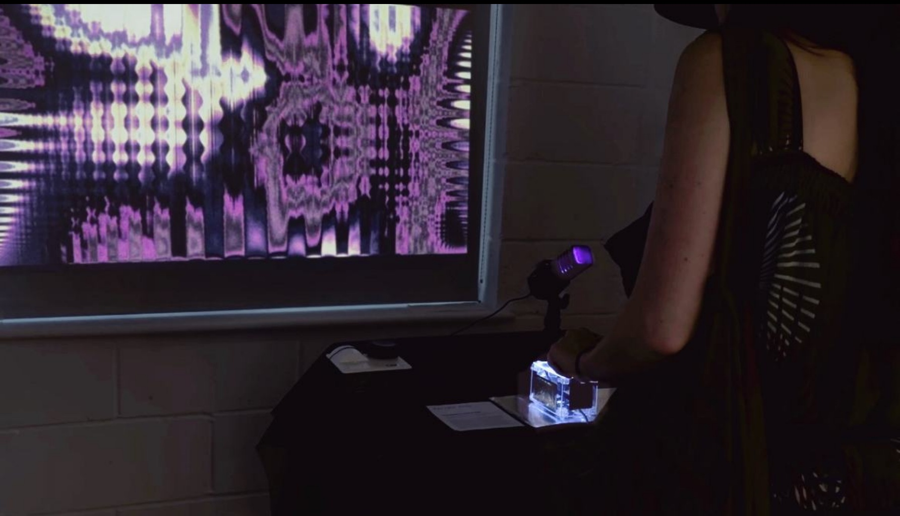
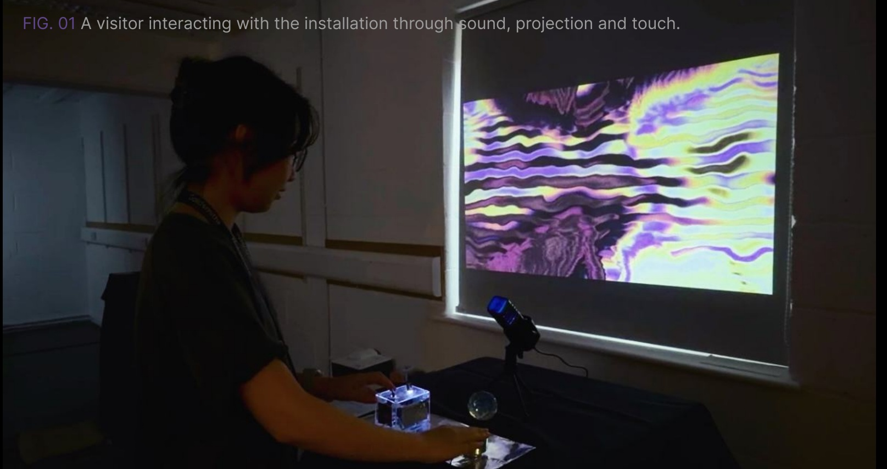
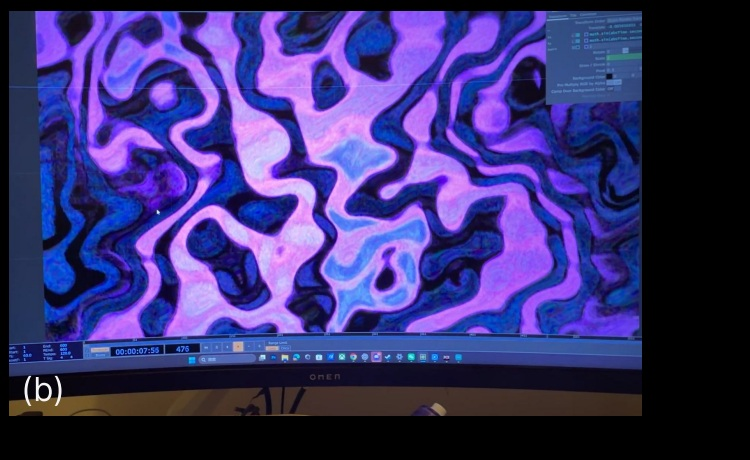
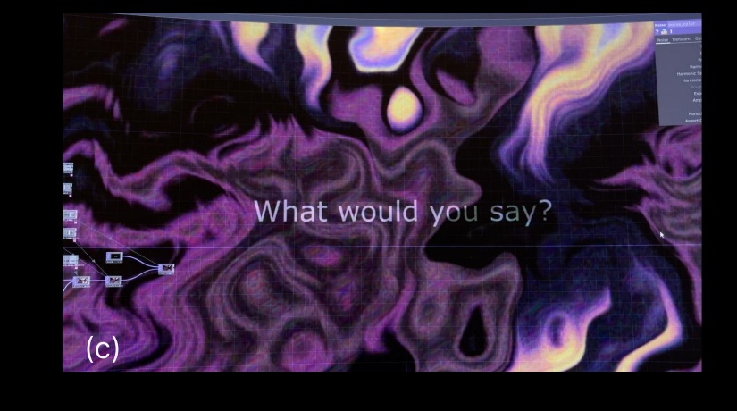
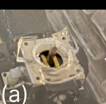
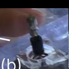
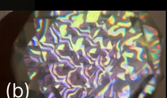
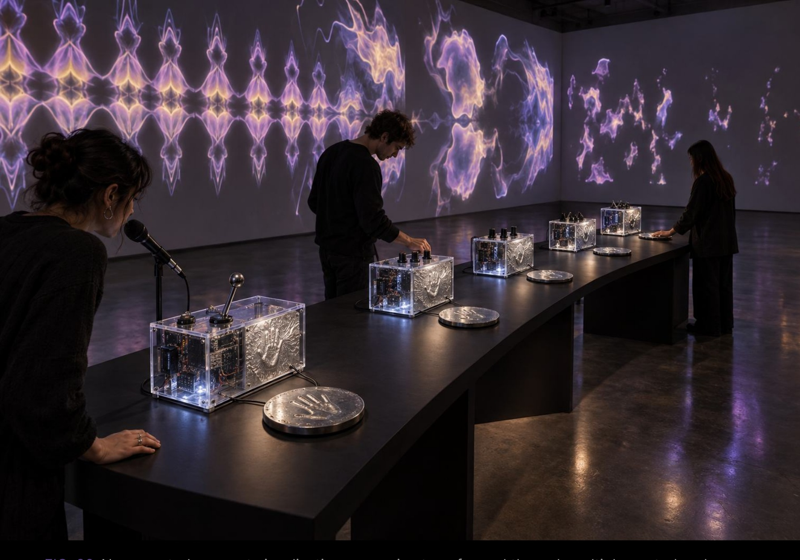

# What Remains Cannot Answer

**An interactive installation by Feiyang Zhou · 2026**

A voice is recorded, repeated and gradually lost through sound, projection and touch.



**[Read Project PDF](docs/What-Remains-Cannot-Answer.pdf) · [Watch Exhibition Video](https://vimeo.com/1229670702) · [Setup Guide](docs/SETUP.md)**

## About the work

*What Remains Cannot Answer* explores the difference between preserving a signal and preserving a presence. A visitor's voice returns five times, becoming quieter and less recognisable. The projection grows more unstable before dissolving, while a metal contact surface carries the voice as vibration.

Research into Edison's speculative spirit phone, Mathilde Lavenne's *Artefact #0: Digital Necrophony* and Rafael Lozano-Hemmer's *Voice Array* informed the work. The full research, development record and reflection are available in the [project PDF](docs/What-Remains-Cannot-Answer.pdf).

## Interaction

1. **Move the lever.** A short beep cues recording.
2. **Speak into the microphone.** The installation captures an utterance.
3. **Listen and touch.** Five increasingly altered returns play through the audio system and metal vibration surface.
4. **Watch the transformation.** The projection changes with the sequence. The faceted glass sphere offers another way to view it.
5. **Let the sequence finish.** The imagery disappears and the prompt returns. Return the lever to centre before starting another interaction.



The glass sphere works optically. It fragments the view of the projection and is not an electronic sensor.

## How it works

```text
Lever → ESP32 → USB serial → Max sequence control
Microphone → Max recording and sound processing
                         ├─ audio → amplifier → transducer → metal surface
                         └─ OSC → TouchDesigner → projector
```

| Part | Responsibility |
| --- | --- |
| ESP32 | Detect lever movement; send a serial trigger; re-arm when centred |
| Max | Record the voice, schedule five returns, change filtering/modulation/levels, and play cue and ambience |
| OSC | Carry amplitude, state and decay control values from Max to TouchDesigner |
| TouchDesigner | Control visual enlargement, distortion, trembling and prompt transitions |
| Amplifier and transducer | Convert the audio output into audible and tactile vibration |

The exhibited system uses **wired USB serial** between ESP32 and Max. Max sends OSC to **127.0.0.1:7000**, using `/remains/amp`, `/remains/state` and `/remains/decay`.

## Setup and project files

| File / document | Purpose |
| --- | --- |
| [butoon.ino](firmware/butoon/butoon.ino) | ESP32 lever firmware |
| [Final_Max_Sound_Stable.maxpat](max/Final_Max_Sound_Stable.maxpat) | Sound processing and control patch |
| [final.toe](touchdesigner/final.toe) | TouchDesigner visual project |
| [Setup guide](docs/SETUP.md) | Dependencies, ports, audio files and verification notes |
| [References and credits](docs/REFERENCES.md) | Tutorials, sound sources and AI use |
| [Project PDF](docs/What-Remains-Cannot-Answer.pdf) | Complete illustrated development and reflection |

To run the complete installation, you need an ESP32 and lever input, microphone, computer with Max and TouchDesigner, projector, amplifier and surface transducer.

1. Upload the sketch using Arduino IDE with support for your ESP32 board.
2. Obtain the [two credited sound effects](docs/REFERENCES.md#sound-assets) and place them beside the Max patch.
3. Open Max, select the correct serial port at **115200 baud**, and configure audio input/output. The supplied patch names **COM3**; change it for your computer. Ensure the `o.pack` object is available.
4. Open the TouchDesigner project and check OSC reception on **port 7000** on the same computer.
5. Select the projector output, enable audio and test the complete interaction.

See the [setup guide](docs/SETUP.md) for details. The supplied code files are unchanged. Repository preparation checked their contents and documentation links; it did not repeat the full hardware test. Third-party audio is obtained separately from the credited source.

## Selected development

### Sound and visual behaviour

My earlier Max assignment, *Echo Accumulator*, informed the delay and decay structure. I reduced an early seven-return version to five and refined filtering, modulation and level changes. In TouchDesigner, I developed PPPANIK's *Geometric Fractals* tutorial through changes to mirroring, shape, colour, distortion and interaction mapping.

| Blue-purple study | Purple-yellow study with prompt |
| --- | --- |
|  |  |

### Making the controls easier to use

**I enlarged the lever** to make it more noticeable and easier to operate. During exhibition setup, I also revised numbered, embossed and handwritten guidance and adjusted the projector and table layout.

| Original lever | Enlarged lever |
| --- | --- |
|  |  |

### Another way of seeing

The faceted glass sphere fragments and repeats the projected imagery, adding a physical viewing action alongside speaking and touching.



The complete fabrication, testing and guidance comparisons remain in the [PDF, pages 7–8](docs/What-Remains-Cannot-Answer.pdf).

## Future direction

I want to test Wi-Fi communication under exhibition conditions and develop a shared spatial instrument: one voice transformed through multiple control and vibration modules. Further processing of pitch, timbre and frequency content could make the echoes and visual changes richer while retaining gradual disappearance.



*AI-generated concept visualisation of a proposed installation, not a photograph of the exhibited work.*

## Credits and AI use

I used AI for troubleshooting, English-language editing and concept imagery. I subsequently revised the trigger logic, sound processing and visual mappings, integrated the hardware and software, and tested the installation. AI also assisted with repository organisation and documentation.

See [full references, sound credits and AI statement](docs/REFERENCES.md). Selected images use the same photographs and studies as the project PDF; the homepage arranges them for browsing and setup rather than reproducing its pages.
