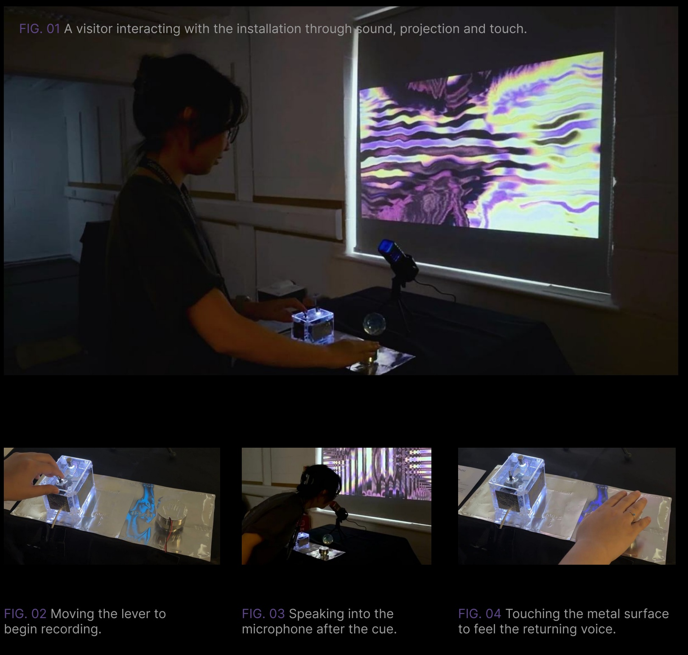
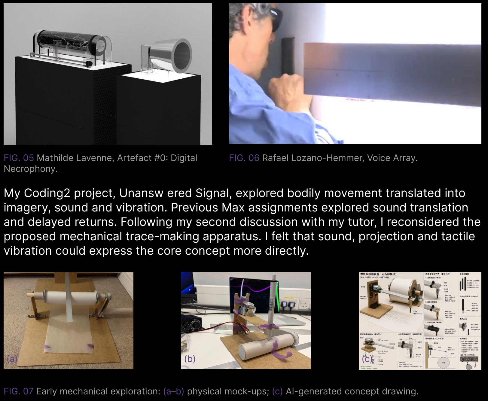
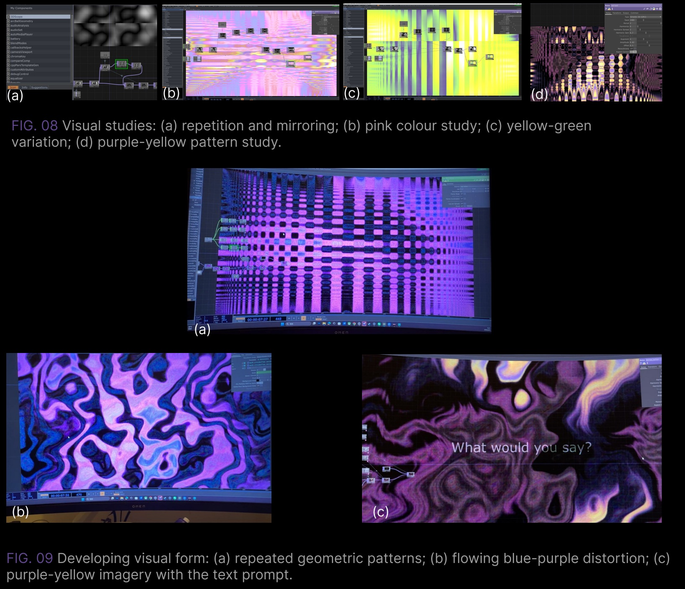
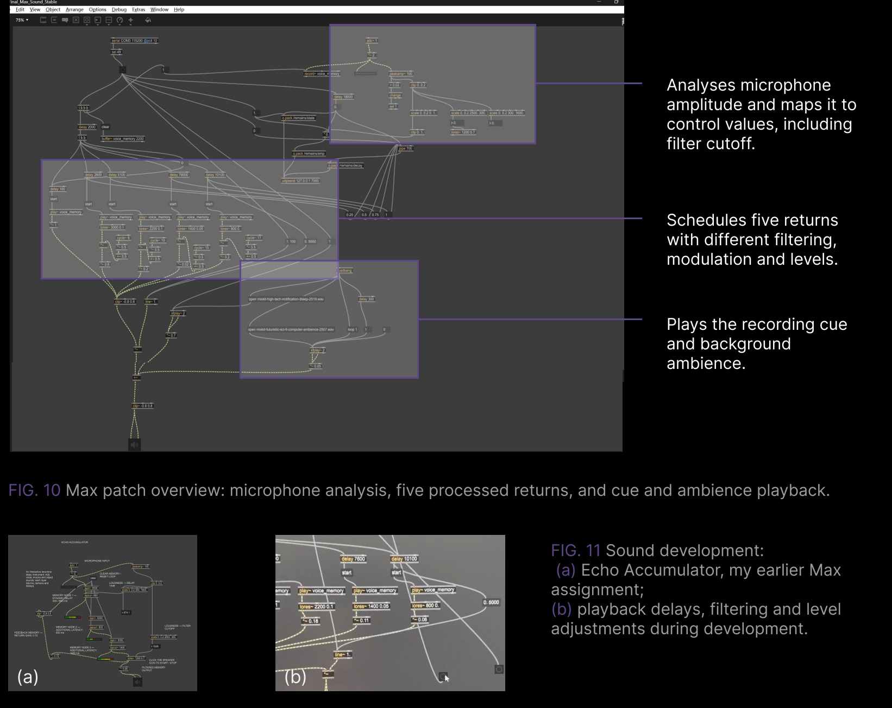
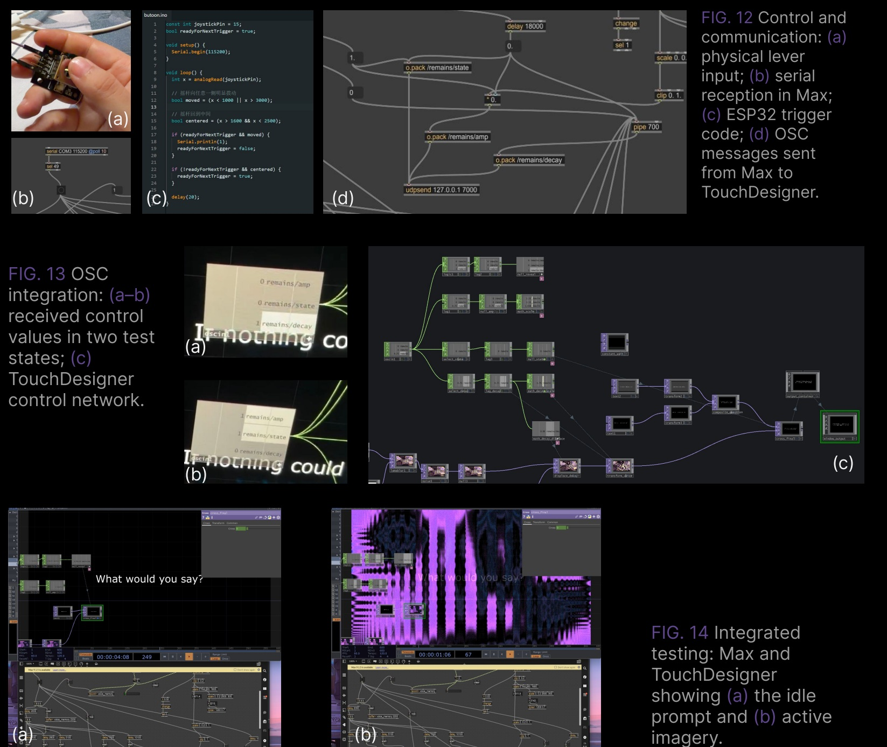
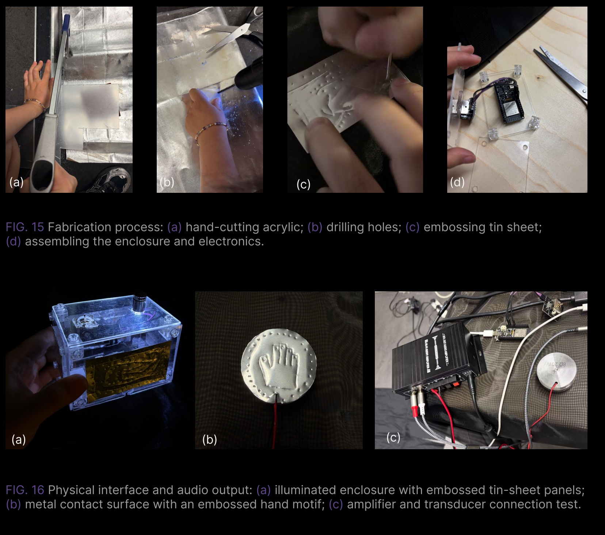
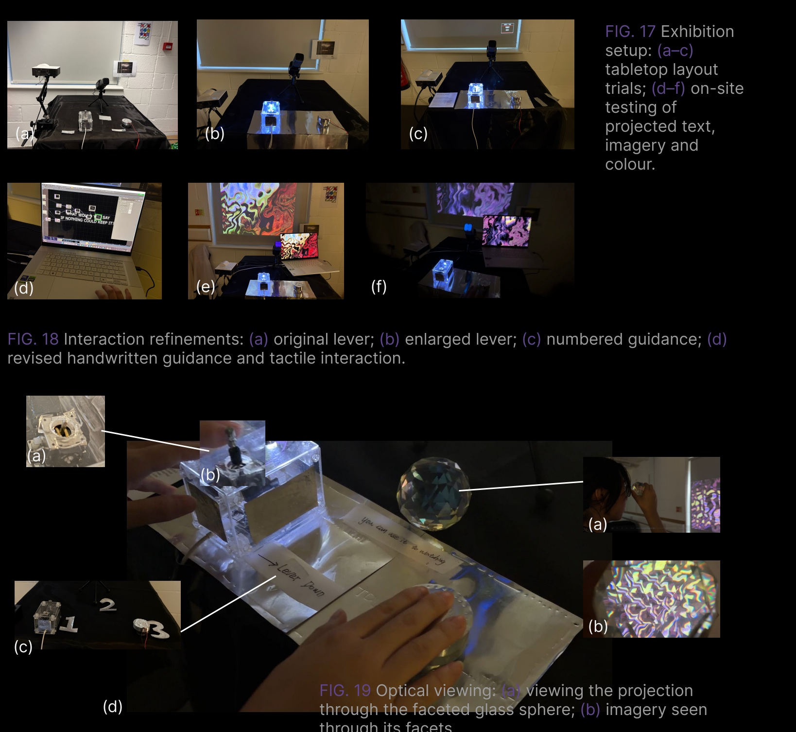
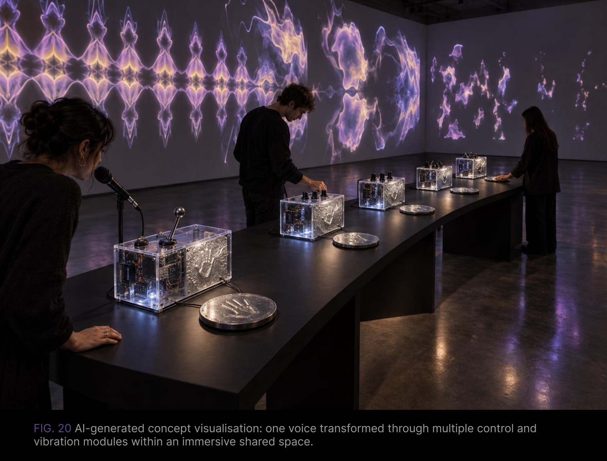

# What Remains Cannot Answer

**Feiyang Zhou · Exhibited 16 August 2026**

An interactive installation exploring how a voice changes as it is remembered, repeated and gradually lost.


[Read the full project PDF](docs/What-Remains-Cannot-Answer.pdf) · [Figma documentation](https://www.figma.com/design/MiHoaIz8vv7OLAKDp2fHXL/Untitled?node-id=0-1) · [Setup instructions](docs/SETUP.md)

**Video:** edited demonstration link to be added.

## 01 / Introduction

Visitors move a lever, hear a cue and speak into a microphone. Their voice is captured and returned through a vibrating metal surface as five increasingly altered echoes. The imagery changes before eventually dissolving into darkness. Through listening, looking and touching, visitors experience a voice becoming a temporary trace.



## 02 / Concept and background research

The project asks what remains when technology attempts to preserve a voice. A recording can retain a signal, but it cannot retain the speaker's presence or provide their response. Repetition makes this distinction perceptible: the voice returns, yet becomes altered and harder to recognise.

Research into Edison's speculative spirit phone and Mathilde Lavenne's *Artefact #0: Digital Necrophony* informed this investigation. Rafael Lozano-Hemmer's *Voice Array* offered a reference for translating voice into light and organising recorded voices over time. My installation focuses on the transformation and disappearance of a single utterance.

My earlier project, *Unanswered Signal*, explored bodily movement translated into imagery, sound and vibration. After discussing an early mechanical mark-making proposal with my tutor, I developed the work through sound, projection and tactile vibration.



*Reference artworks and the early proposal are reproduced here as presented and identified in the project PDF. They are distinct from the completed installation.*

## 03 / Technical implementation

### Visual development

Using PPPANIK's *Geometric Fractals* tutorial as a foundation, I added mirroring and adjusted base shapes, colour and distortion. The studies below follow the PDF's sequence, from early repeated patterns and colour tests to blue-purple distortion and purple-yellow imagery with the text prompt.

OSC values from Max coordinate enlargement, distortion and trembling with the five voice returns. The prompt remains visible while idle, transitions into the imagery after the lever is moved, and returns when the sequence ends.



### Sound development

My earlier Max assignment, *Echo Accumulator*, informed the use of delay, filtering and decay. A short beep cues recording. Max then plays the recorded voice through an amplifier and vibration transducer as five tactile and audible echoes. Filtering, modulation and level changes make successive returns quieter and less recognisable.

An early seven-return version produced an unwanted high-pitched sound. I reduced it to five returns and refined the processing, background ambience and timing.



### Control and visual integration

```text
Lever → ESP32 → USB serial → Max
Microphone → Max recording and processing
                         ├─ audio → amplifier → transducer → metal surface
                         └─ OSC → TouchDesigner → projection
```

The ESP32 sketch sends a trigger when the lever moves and re-arms after it returns to centre. Max sends `/remains/amp`, `/remains/state` and `/remains/decay` to TouchDesigner through OSC on local port 7000. I tested the complete chain across repeated interactions, refining the relationship between triggering, sound playback and visual transitions.



### Physical interface and vibration output

I hand-cut and drilled the acrylic enclosure, assembled the electronics and added embossed tin-sheet panels and lighting. I reused the vibration transducer from my earlier project, connecting the computer's audio output through an amplifier to the transducer and metal contact surface. An embossed hand motif indicates where visitors can touch and feel the returning echoes.



### Exhibition testing and refinement

On site, I adjusted the projector position and repeatedly rearranged the microphone, controller, tactile output and metal-sheet base. I refined the projected text, imagery and colours, checking their appearance in the exhibition space.

**I enlarged the lever to make it more noticeable and easier to operate.** I also revised the numbered, embossed and handwritten guidance. A faceted glass sphere provided an additional way to view the projection, fragmenting and repeating its changing imagery.



### Files and running the installation

| File | Purpose |
| --- | --- |
| [ESP32 sketch](firmware/butoon/butoon.ino) | Lever input and serial triggering |
| [Max patch](max/Final_Max_Sound_Stable.maxpat) | Recording, sound processing, sequence control and OSC |
| [TouchDesigner project](touchdesigner/final.toe) | Visual system |
| [Setup notes](docs/SETUP.md) | Ports, dependencies, external sound files and checks |

The three supplied program files are unchanged. Repository preparation checked file integrity and local documentation links; it did not re-run the hardware installation. The external sound files and their required filenames are documented in [References](docs/REFERENCES.md#sound-assets).

## 04 / Reflection and future development

The project taught me that physical guidance and audiovisual timing shape the experience. Enlarging the lever and revising instructions helped connect visitors' actions with the changing voice.

I retained wired serial communication for this exhibition because I was concerned about wireless reliability on site. In future, I would test Wi-Fi communication between ESP32 and Max to reduce cabling and allow more flexible controller placement.

The tutors described the enclosure as having a guitar-pedal aesthetic and suggested multiple modules within a larger space. I want to develop this as a shared spatial instrument, with one voice transformed through several controls and vibration modules. More detailed processing of pitch, timbre and frequency content could produce richer echoes and visual transformations while retaining gradual degradation and disappearance.



*AI-generated concept visualisation, Fig. 20. This depicts a future proposal, not the exhibited installation.*

## 05 / References and AI use

See [references, sound credits and AI use statement](docs/REFERENCES.md). The [full PDF](docs/What-Remains-Cannot-Answer.pdf) includes the original figure captions and reference page.

All images on this page are taken directly from the supplied PDF, in its order. Figure groups retain their original comparisons, labels and arrangement. [Image provenance](docs/image-manifest.json) records each source page.
